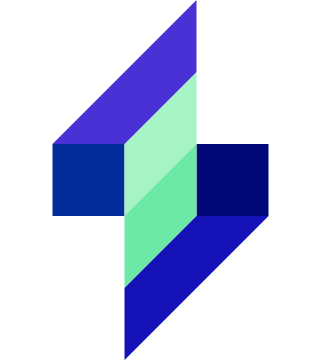

# [bizGrowth](https://bizgrowth.vercel.app/)

## Introduction

link web bizGrowth : https://bizgrowth.vercel.app/

bizGrowth is a web platform dedicated to empowering Micro, Small, and Medium Enterprises (UMKM) by providing them with tools and resources to foster business growth. The name "bizGrowth" reflects our commitment to assisting UMKM in expanding their ventures efficiently and sustainably.

## Philosophy

In choosing the brand name "bizGrowth," several elements were considered:

### Focus on Business Growth

bizGrowth emphasizes business growth, aligning with the primary needs of UMKM to thrive and multiply. This reflects the platform's main goal of aiding UMKM in enhancing their businesses.

### Simplicity and Memorability

Selecting a name that is simple and easy to remember is crucial for potential users to recall and revisit the platform effortlessly. "bizGrowth" meets both criteria, facilitating brand recognition.

### Continuity and Adaptation

The term "Growth" emphasizes the concept of sustainable growth and progress. It reflects that the platform not only assists UMKM in flourishing but also in adapting to market and technological changes.

### Leadership and Authority

The term "Biz" is short for "business," emphasizing its focus on the business world. This creates an impression that the platform is an authority on business growth for UMKM.

Therefore, the philosophy behind the brand name "bizGrowth" is to provide a platform focused on UMKM business growth, simple yet memorable, with a commitment to continuity and change, while building a sense of leadership and authority in supporting UMKM.

## 19 Content Sections

## 1 Navbar Component

The navbar component provides easy navigation throughout the platform, ensuring a seamless user experience.

## 1 Footer Component

The footer component contains important links, contact information, and social media icons, enhancing accessibility and engagement.

## 2 Modals

1. **Video Modal**

    - Popup modal for viewing umkm go digital video.

2. **Article Modal**
    - Popup modal for reading featured articles or blog posts.

## Color Philosophy: Blue

The dominant color scheme of bizGrowth is blue, reflecting the following philosophies:

### Professionalism and Trust

Blue is often associated with professionalism and trustworthiness. It helps build trust among UMKM owners accessing the platform, making them feel comfortable and confident in the information or services provided.

### Tranquility and Intelligence

The calming shade of blue also conveys a sense of tranquility and intelligence. This is crucial when users are seeking solutions or information to develop their businesses, creating a peaceful and focused environment.

### Stability and Credibility

Blue is frequently linked with stability and credibility. In the context of the UMKM platform, it conveys that the platform is stable and reliable as a source of information or support for business growth.

### Connection and Sustainability

Certain shades of blue, especially brighter ones, evoke associations with water and the sky. This can be interpreted as a symbol of connection and sustainability, portraying the platform as a "source" providing continuous resources and support for UMKM.

Therefore, the philosophy behind using the color blue on the web platform for UMKM is to establish a sense of professionalism, trust, tranquility, intelligence, stability, credibility, connection, and sustainability, all of which are relevant to the needs and expectations of UMKM owners using the platform.

## Conclusion

bizGrowth is committed to being a trusted partner for UMKM, providing them with the tools, resources, and support they need to thrive in today's competitive market. With a focus on simplicity, reliability, and continuous improvement, we aim to contribute to the growth and success of UMKM everywhere.

---

For more information, visit [bizGrowth.com](https://www.bizgrowth.com) or contact us at info@bizgrowth.com.
